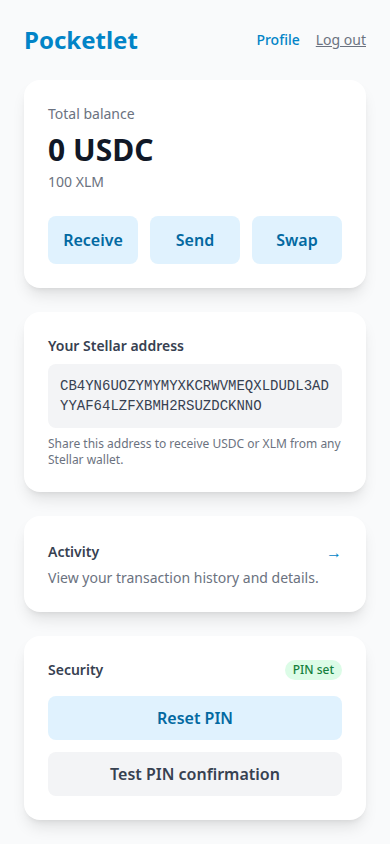
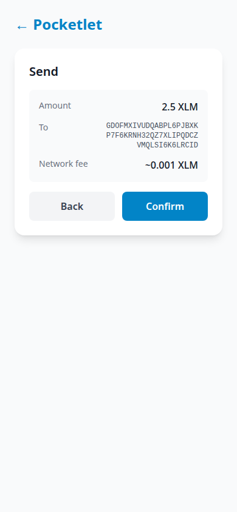
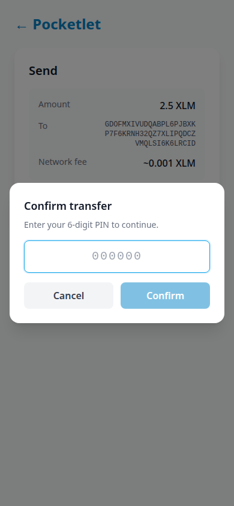
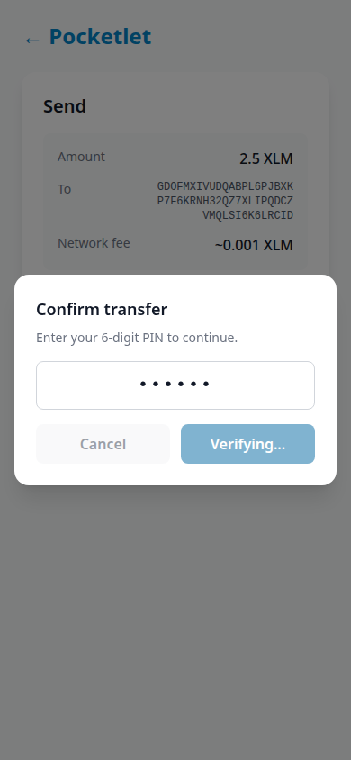
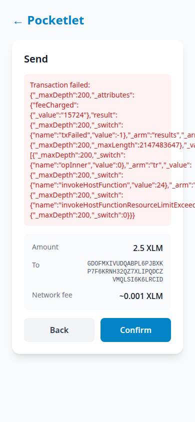

# Pocketlet

Pocketlet is a web-based wallet for the Philippine market that feels like a traditional e-wallet (GCash, Maya) but settles on the Stellar blockchain. V1 runs on Stellar Testnet, supports USDC and XLM, and uses passkey-based abstracted custody with a Soroban smart wallet.

## Features

- **Email + passkey signup** — no seed phrase required.
- **Abstracted custody** — each user gets a Soroban smart wallet controlled by a passkey-derived Ed25519 signer.
- **Receive USDC/XLM** — share a Stellar address or QR code.
- **P2P transfers** — send USDC or XLM to any Stellar address (Pocketlet users by username/phone, or raw addresses).
- **USDC ↔ XLM swaps** — via a configurable DEX contract.
- **PIN confirmation** — required for all payments and swaps.
- **Transaction details** — view fees, operation details, and on-chain hash.
- **Lost-passkey recovery** — email-based recovery with a waiting period and new passkey registration.

## Screenshots


## Project Structure

This is a pnpm monorepo:

```
.
├── apps/web                    Next.js 14 PWA frontend (App Router)
├── packages/contracts            Soroban smart contracts (Rust)
├── packages/config             Shared ESLint, TypeScript, Tailwind config
├── SPEC.md                     V1 product spec
├── FUTURE_VERSIONS.md          V2 and deferred feature roadmap
├── TESTNET.md                  End-to-end testnet testing guide
└── README.md                   This file
```

## Deployed Contracts (Testnet)

These are the contracts currently deployed on Stellar Testnet for this project:

| Contract | Address | Notes |
| --- | --- | --- |
| Circle USDC SAC | `CBIELTK6YBZJU5UP2WWQEUCYKLPU6AUNZ2BQ4WWFEIE3USCIHMXQDAMA` | Official Circle testnet USDC Stellar Asset Contract |
| Pocketlet Smart Wallet (example) | `CA7FMXWUMM3C37O4QF4E4R4KKXZIEBV7CTFHKDRDXPBLZQ2NMC5PZC5G` | One of the wallets deployed during testnet testing |
| Pocketlet Smart Wallet (example) | `CCTTR6BVBPGWW76HFCRSPQAXZCOC4HKUF5BKK3ZDO7V7B6PIPDKP2BFQ` | Another wallet deployed during testnet testing |

The DEX contract is auto-deployed from `mock_dex.wasm` on first swap when `DEX_CONTRACT_ID` is not set. The address is cached in `apps/web/.data/dex_contract_id`.

## Prerequisites

- [Node.js](https://nodejs.org/) 20+ (LTS recommended)
- [pnpm](https://pnpm.io/) 11.13.1+ (the monorepo uses `packageManager: pnpm@11.13.1`)
- [Rust](https://rustup.rs/) and [stellar-cli](https://developers.stellar.org/docs/build/smart-contracts/getting-started/setup) for contract builds
- A Stellar Testnet wallet (e.g., [Laboratory](https://laboratory.stellar.org/#testnet), [LOBSTR](https://lobstr.co/), or a testnet-funded account) for end-to-end testing

## Install

```bash
pnpm install
```

## Build Smart Contracts

The web app needs the compiled `pocketlet_wallet.wasm` and `mock_dex.wasm` artifacts.

```bash
pnpm run build:contracts
```

This runs `stellar contract build` in `packages/contracts` and produces:

```
packages/contracts/target/wasm32v1-none/release/pocketlet_wallet.wasm
packages/contracts/target/wasm32v1-none/release/mock_dex.wasm
```

## Run Tests

### Rust contracts

```bash
pnpm run test:contracts
```

### Frontend (unit tests)

```bash
pnpm --filter web test
```

### Lint and TypeScript

```bash
pnpm run lint
pnpm run typecheck
```

## Configure the Web App

Copy the example environment file and edit as needed:

```bash
cp apps/web/.env.example apps/web/.env.local
```

Key variables:

| Variable | Description | Default |
| --- | --- | --- |
| `NEXT_PUBLIC_STELLAR_RPC_URL` | Soroban RPC endpoint | `https://soroban-testnet.stellar.org` |
| `NEXT_PUBLIC_STELLAR_HORIZON_URL` | Horizon REST endpoint | `https://horizon-testnet.stellar.org` |
| `NEXT_PUBLIC_STELLAR_NETWORK_PASSPHRASE` | Stellar network passphrase | Testnet |
| `NEXT_PUBLIC_USDC_CONTRACT_ID` | Circle testnet USDC SAC | `CBIELTK6YBZJU5UP2WWQEUCYKLPU6AUNZ2BQ4WWFEIE3USCIHMXQDAMA` |
| `PLATFORM_SECRET_KEY` | Platform deployer secret key | generated & funded automatically on testnet |
| `DEX_CONTRACT_ID` | DEX contract for swaps | auto-deployed from `mock_dex.wasm` on testnet |
| `RECOVERY_WAITING_PERIOD_MS` | Lost-passkey recovery waiting period | 24 hours (set to `60000` for quick testing) |
| `WEBAUTHN_RP_ID` | WebAuthn relying party ID | `localhost` |
| `WEBAUTHN_ORIGIN` | WebAuthn origin | `http://localhost:3000` |
| `SESSION_SECRET` | JWT session signing secret | `change-me-in-production` |

## Run the App

```bash
pnpm run dev:web
```

Open `http://localhost:3000`.

For passkey registration/login to work in Chrome, you must use `localhost` (or configure HTTPS and `WEBAUTHN_RP_ID` accordingly). Passkeys are tied to origin.

## Testnet End-to-End Flow

See [`TESTNET.md`](./TESTNET.md) for a step-by-step guide to test the full V1 flow on Stellar Testnet:

1. Deploy the smart wallet
2. Receive USDC/XLM from an external testnet wallet
3. Send USDC/XLM to another account
4. Swap USDC ↔ XLM
5. Recover a lost passkey

## Architecture Overview

- **Smart wallet contract** (`packages/contracts/contracts/pocketlet_wallet`) — a `CustomAccountInterface` contract that stores a passkey-derived Ed25519 owner and a platform recovery admin. Supports `transfer`, `swap`, and `rotate_owner`.
- **Owner key** — generated server-side at wallet deployment, stored per user, and used to sign the custom-account authorization payload.
- **Platform deployer** — pays for WASM upload, contract deployment, and network fees. It is also the wallet's `recovery_admin`.
- **DEX** — on testnet, the bundled `mock_dex.wasm` is deployed automatically when `DEX_CONTRACT_ID` is unset. In production, point to a real Stellar DEX/AMM.
- **Balances** — read from the Stellar Asset Contract (SAC) for USDC and XLM.
- **Transactions** — fetched from Horizon and classified into receive, send, and swap.

## Scripts

```bash
pnpm run dev:web            # Start the web app in dev mode
pnpm run build:web          # Build the Next.js app
pnpm run start:web          # Start the production build
pnpm run build:contracts    # Build all Soroban contracts
pnpm run test:contracts     # Run contract tests
pnpm run lint               # Run ESLint on the web app
pnpm run typecheck          # Run TypeScript type checking on the web app
```

## Security Notes

- V1 is a testnet technology interface. It does not custody funds, perform KYC, or process fiat.
- User funds live in their own Soroban smart wallet.
- The platform deployer key can rotate the wallet owner after email verification. In production, store `PLATFORM_SECRET_KEY` in a secrets manager.
- Email verification returns the code in the API response for testnet convenience. Replace with a real transactional email provider before production.

## Screenshots

### Home / Balance




### Send Flow









## License

UNLICENSED — this project is in active development.
